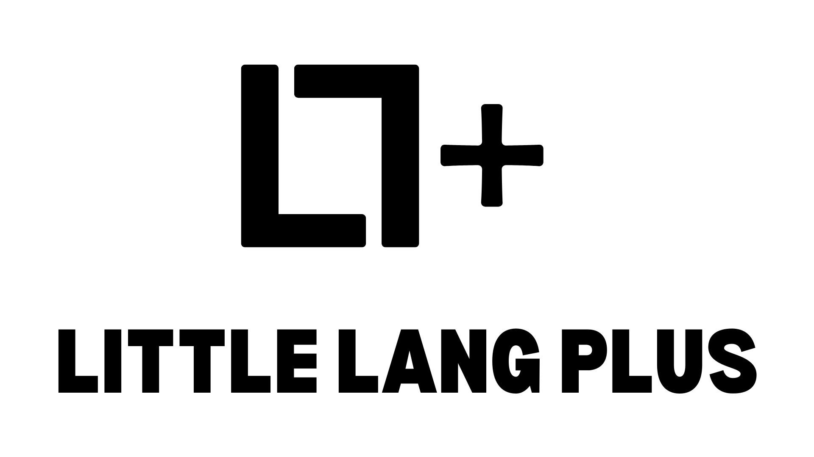

## Little-Lang-Plus

Welcome to the codebase of Little Lang Plus. The littlest langauge you can find! Constant updates keep the project on track to make it alittle, less little ;). I hope you find as much joy in Little Lang Plus as I do.

How to run:
Make a file with the .LLp extension. Open it with VS Code. Click on the search bar and type a ">". Then choose "Task: Configure Task", then choose "Create tasks.json file from template". Paste in the tasks.json file all ready made and switch the file path to the filepath of your LL+ file. Now, if you press "ctrl + shift + b" in your .LLp file and choose "Run LLp file", your Little Lang Plus program will run!

Documentation at: LL+ Docs

Have fun!
